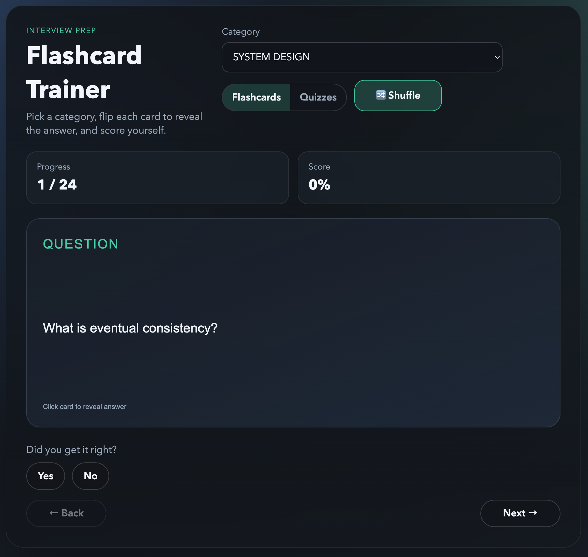
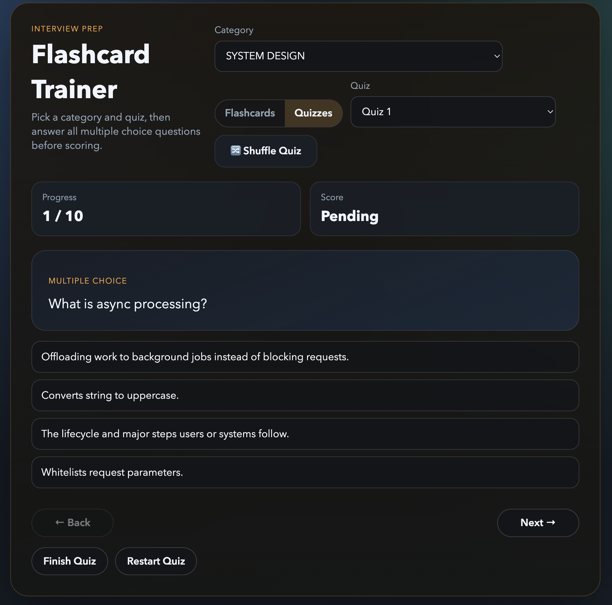

# Flashcards

[](https://rubyonrails.org/)
[](https://www.sqlite.org/)
[](https://hotwired.dev/)

Local Rails study trainer for interview and certification prep. Browse study decks as flashcards or switch into multiple choice quiz mode, shuffle the current study flow, and track your score per category.

## Screenshot





## Features

- Category-based decks backed by seeded data
- Flashcard mode with card flip animation and next/previous navigation
- Quiz mode with 3 quizzes per category and 7-14 questions per quiz
- Yes/no self-grading with score tracking
- Shuffle mode for randomized flashcard review and quiz-order reshuffling
- End-of-quiz review showing both your selected answer and the correct answer
- Responsive dark UI for desktop and mobile

## Decks

- System Design
- Ruby on Rails - Architecture & Patterns
- Rails Doctrines
- Rails API Design
- Rails Error Handling
- React - Core Concepts
- React Hooks
- React Testing
- AWS Solutions Architect - Associate (SAA-C03)
- GitHub Actions / GH-200
- Ruby Methods
- Rails Methods
- SQL

## Run Locally

```bash
bundle install
bin/rails db:setup
bin/rails s
```

Open http://localhost:3006.

## Tests

```bash
bin/rails test
```

## Notes

- Flashcards live in [db/seeds.rb](db/seeds.rb).
- The interactive deck and quiz flows are driven by Stimulus in [app/javascript/controllers/flashcards_controller.js](app/javascript/controllers/flashcards_controller.js).
- The UI is styled in [app/assets/stylesheets/application.css](app/assets/stylesheets/application.css).

